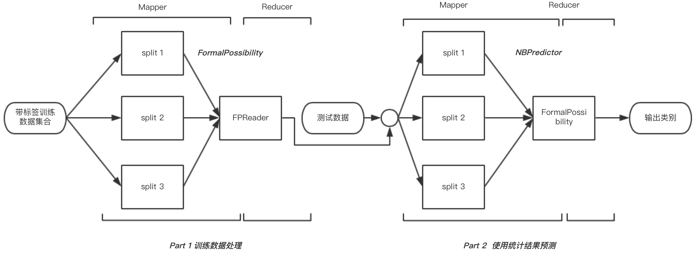
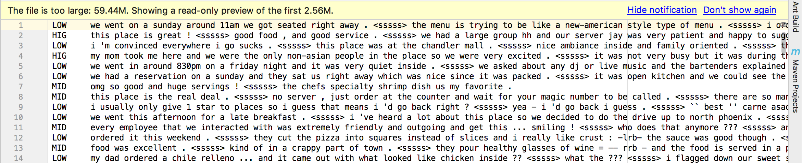
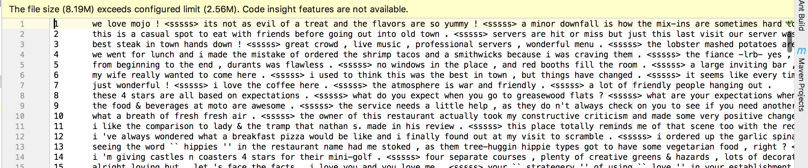
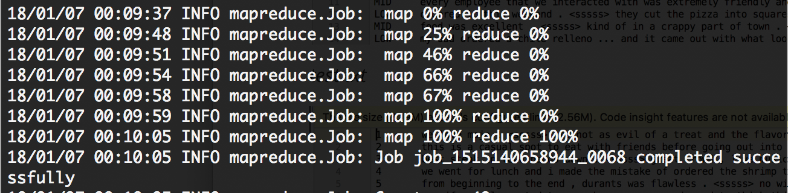
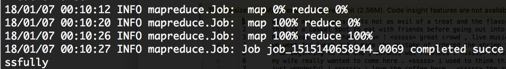
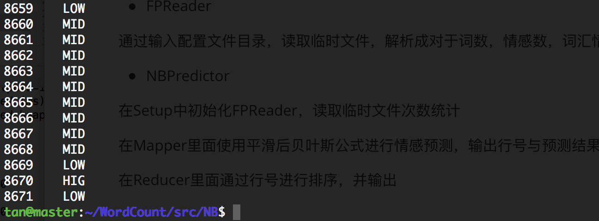

# 分布式的朴素贝叶斯多元分类算法实现

|  组号  |         组员1         |         组员2         |    时间    |
| :--: | :-----------------: | :-----------------: | :------: |
|  17  | 檀祖冰（15352306，实现+报告） | 任磊达（15352285，实现+报告） | 2018-1-7 |

[TOC]

## 简要背景

### 朴素贝叶斯

朴素贝叶适分类器是机器学习领域中，基于贝叶斯理论的概率模型分类器的一种，并认为特征与分类之间概率独立。算法简述如下：若一个样本有n个特征，组成特征向量$\vec {V_j}=(v_1,v_2,v_3,...,v_n)$, 那么将其划分到类$C_k$的可能性为

  ​
$$
\begin{eqnarray*}
  P(C_k|\vec {V_j}) &=&\frac{P(C_k)P(\vec {V_j}|C_k)}{P({\vec{V_j}})} \tag {1}\\\\
  &=&\frac{P(C_k)\prod_{i=1}^{n}P(v_i|C_k)}{P({\vec{V_j}})}\tag {2} \\\\
  &\propto &P(C_k)\prod_{i=1}^{n}P(v_i|C_k) \tag {3}
  \end{eqnarray*}
$$
一般而言，采用多项式模型

该模型常用于文本分类，特征是单词，值是单词的出现次数。

$$
P(v_{i}|C_{k}) = \frac{N_{C_{k}, v_{i}}}{N_{C_{k}}}\tag {4}
$$
其中，$N_{C_{k}, v_{i}}$为在类$C_k$下特征$v_i$出现的总次数，$N_{C_k}$为类$C_k$下所有特征出现的总次数(包含重复)。如果待测样本中的特征$v_i$不在训练集中，即$N_{C_{k}, v_{i}}$将为0，那么由于朴素贝叶斯中使用累乘的形式，那么将会直接导致整个式子概率为0，可以通过拉普拉斯平滑来处理。拉普拉斯平滑使用一个参数$\alpha$, 若假设特征项数量为$D$, 那么式$(4)$重写
$$
P(v_i|C_k)=\frac{N_{C_k,v_i}+\alpha}{N_{C_k}+\alpha D} \tag{5}
$$
实践证明，越小的$\alpha$值提供了越好的效果，因为越小的$\alpha$值得到的概率结果越接近原来的结果。而使用朴素贝叶斯进行分类步骤为

* 处理训练数据
  * 将每一个文本的标签表示为label的One-hot矩阵，这样子的好处是可以方便地后期调整每一个label的权值，修正由于某一个label数目过少而造成的分类偏差。
  * 求出对应每一个类别下的词组**频数**向量，构成一个$L×W$的矩阵，记为$\text {LW}$，其中$L$为类别总数，$W$为词集大小。 
* 输入待测词向量
  * 拆分词组得到词向量$\vec V$

  * 设输入文档有$t$个特征 ( t 个不同的词)， 训练集维数为D，平滑系数为$\alpha$

  $$
  \begin{eqnarray*}
  P(C_k|\vec {V_j}) &\propto& P(C_k)\prod ^{t}_{i=0}\frac{N_{C_k,v_i}+\alpha}{N_{C_k}+\alpha D}\tag{6}\\\\
  P(C_k|\vec {V_j}) &\propto&P(C_k)\sum_{i=0}^{t}\log{\frac{N_{C_k,v_i}+\alpha}{N_{C_k}+\alpha D}}\tag {7} \\\\
  &\propto& \log P(C_k) -t \log(N_{C_k}+\alpha D)+\sum_{i=1}^{t}\log{(N_{C_k,v_i}+\alpha)}\tag {8}
  \end{eqnarray*}
  $$

  - 输出最大概率对应的类别

### MapReduce

MapReduce是一个适用于处理包含大量数据集的并行化问题的框架，它由许多节点构成一个集群或者网络。MapReduce的处理过程主要分为一下三步

* *Map过程*      系统从总的数据中，为每一个节点分配一定的数据，节点使用这个数据进行计算，得到临时的节点处理结果
* *Shuffle过程*   系统为每一个节点都分配了一个唯一的key值，节点的处理结果与其key值绑定在一起
* *Reduce过程*   最后系统在Master上根据各个节点的Key值与每一个节点的临时处理结果进行一个汇总处理，得到最终的处理结果

在本次设计中有两个亮点

* 恰当地处理了原数据集，使得更适用于分布式的计算
* 利用分布式节点数量较多的特点，使得无论是从庞大的数据集中统计先验数据，还是计算不小数目的测试集合的后验概率的计算，都可以快速完成

## 系统设计

### 系统配置

* VM Fusion
* Mac OS
* master、slave1、slave2 均分配 2GB内存
* hadoop

### 系统需求

系统能够输入一定量的文本训练数据，进行词频、类别等分类需要数据的统计；当完成统计之后，利用统计结果对每一个测试样本进行预测。显然，在文本训练阶段，数据集本身与数据集构成的词汇量非常地大，我们可以通过分布式的思想，划分训练集给每一个节点分别统计。在预测阶段，在测试数据量不小的情况下，同样使用分布式的预测方法，将大大减少了整个测试数据集进行预测的时间。基于以上简单的分析，可概括为

* 划分训练数据到个节点进行式子$(5)$中  $N_{C_k,v_i}、N_{C_k}、D$    的计算
* 划分测试数据到个节点，并使用第一步的结果，结合 式$(8)$ 预测每一个测试样本的类别

### 模块设计




根据需求，此分布式系统将划分为两个部分

* ***统计***    输入的带有标签集合的文本训练数据集，经过hadoop自行分配到各节点进行统计计算。
* ***预测***    使用朴素贝叶斯预测输入的句子

为了让两个模型连接起来，另外实现了一个用于保存词汇散列表的 FPReader 的管理类

#### 统计（FormalPossibility）

##### 简介

为了更好地利用节点进行词频等特征的计算，在统计的前半部分将词语进行重新组合，假设有如下的训练集合，标签分别为 MID、HIGH、LOW

```
Apple Banana MID
LOVE HATE HIGH
STREET PEOPLE LOW
```

在第一阶段，将对它们进行笛卡尔积的计算，可以看到每一个项包含了所属类别和特征，这样处理可以方便个节点进行分布式的统计

```
MIDApple 
MIDBanana
HIGHLOVE
HIGHHATE 
LOWSTREET
LOWPEOPLE 
```

在分配给每一个节点之后，可以方便地统计出所分配的数据中

* 每一个分类的特征是多少
* 每一个分类下，每一个特征的出现的次数
* 总的特征数目是多少 

在Mapper部分，系统将会按照 以训练数据的行号为key，句子字符串为 value进行输入，需要实现将句子分割为单词，接着进行笛卡尔积拼接，统计尽在当前节点的计数

在Reducer部分，将会以每一个单词作为key，以一个计数变量作为value进行输入；在这一步需要将Mapper部分的计数结果进行汇总，形成整个文章中的计数

##### 实现

在继承Mapper后，需要实现`public void map(Object key, Text value, Context context)` 此时`key`为行号，而`Text`为对应行的字符串；接下来使用`StringTokenizer`分割字符串为单词，接着对于每一个单词，连接其类别作为结果，最后使用` context.write(word, one)` 统计结果

```java
public static class FPMapper 
  extends Mapper<Object, Text, Text, IntWritable> {
  final IntWritable one = new IntWritable(1);
  private Text word = new Text(); 
  public void map(Object key, Text value, Context context)
          throws IOException, InterruptedException {
    StringTokenizer itr = new StringTokenizer(value.toString());
    // count the emotion
    String emotion = itr.nextToken();
    // count the text with emotion
    while (itr.hasMoreTokens()) {
      String now = itr.nextToken();
      if(now.charAt(0) >= 'a' && now.charAt(0) <= 'z')
      { // Text formor: emotion + words
        word.set(emotion+now);
        context.write(word, one);
}}}}
```

在汇总部分，获得了每一个节点的统计结果,类型为`Iterable<IntWritable>` 最后迭代求和得到每一个`Text` 对应的频数，最后使用` context.write(words, new IntWritable(val))` 得到总频数

```java
public static class FPReduce  
  extends Reducer<Text, IntWritable, Text, IntWritable> {
  public void reduce(Text words, Iterable<IntWritable> Cnt, Context context)
          throws IOException, InterruptedException {
    int val = 0;
    for(IntWritable v : Cnt){
      val += v.get();
    }
    context.write(words, new IntWritable(val));
}}
```

#### 传送处理（FPReader）

##### 简介

在两个模型之间进行直接通信存在一定的技术困难，在本系统中，采用的是存在中间文件的方法，使得第一个模型的结果能够被第二个模型所使用。并把这个处理数据的方法与变量封装为一个类 FPReader

可知第一部分的结果为特征与分类的笛卡尔积，这些结果将在 `FPReader` 中进行处理，`FPReader`作为中间类，拥有三个 散列表 （`HashMap<String, Integer>`），分别用于统计

* ***freq***      每一个 word 在每一个分类中的数目
* ***emoF***    每一个分类在训练集中的数目
* ***worF***     每一个word在训练集中的数目

这些统计结果，将会与式$(5)、（8）$在下一个模型使用。

##### 实现

在hadoop中，配置都被保存在一个文件中，指明文件对应的名字或者询问Context即可读取配置，为FPReader添加一个方法`public void getData(String paramString, Configuration paramConfiguration) `

接着读取路径与文件状态

```java
Path localPath1 = new Path(paramString);
FileSystem localFileSystem = localPath1.getFileSystem(paramConfiguration);
FileStatus[] arrayOfFileStatus = localFileSystem.listStatus(localPath1);
```

在进行必要的文件判断之后，进行文件的读取

```java
FSDataInputStream localFSDataInputStream = localFileSystem.open(localPath2);
InputStreamReader localInputStreamReader = 
  			new InputStreamReader(localFSDataInputStream);
BufferedReader localBufferedReader = 
  			new BufferedReader(localInputStreamReader);
```

根据笛卡尔积结果统计数据

```java
while ((str1 = localBufferedReader.readLine()) != null)
{ //分割
  String[] arrayOfString2 = str1.split("\t");
  Integer localInteger2 = new Integer(arrayOfString2[1]);
  //统计每一个 word 在每一个分类中的数目
  freq.put(arrayOfString2[0], localInteger2); 
  String str2 = arrayOfString2[0].substring(0, 3);
  //统计每一个分类在训练集中的数目
  emoF.put(str2, (Integer) emoF.
           getOrDefault(str2, localInteger1) + localInteger2);  
  String str3 = arrayOfString2[0].substring(3);
  //统计每一个word在训练集中的数目
  worF.put(str3, (Integer) worF.
           getOrDefault(str3, localInteger1) + localInteger2);
}
```

最后需要关闭所有已经打开的文件句柄

```
localBufferedReader.close();
localInputStreamReader.close();
localFSDataInputStream.close();
```

#### 预测（NBPredictor）

##### 简介

在预测模型中，需要获得第一个模型的统计结果，由此实例化数据管理类 FPReader ，并从第一个模型保存的统计数据文件中获得需要的统计结果，存在 FPReader的成员变量中。

在Mapper 的setUp阶段，每一个节点都有一个包含了全部信息的Hash Table用于查询词频。

在Mapper部分，每一个被预测的词向量根据FPReader中统计的词特征数据与分类数据，由$(8)$计算对应每一个分类的概率，选取最高的作为预测结果。由于MapReducer的执行时为乱序，所以，给每一个输入的特征向量一个ID号，并且以 (ID, Class)的方式进行保存。

在Reducer部分，只需要统计一个 ID 对应的类比即可

##### 实现

在开始进行Mapper之前，加载第一个模型的数据

```Java 
public void setup(Context paramMapper) {
  ...
  Configuration localConfiguration = paramMapper.getConfiguration();
  train = new FPReader();
  train.getData(localConfiguration.get("train_result"), localConfiguration);
  ...
}
```

使用模型数据进行计算

计算每一个分类的先验概率

```java
double p_low = Math.log(alpha + (Integer) train.emoF.get("LOW") * 1.0D / train.emoF.size());
double p_mid = Math.log(alpha + (Integer) train.emoF.get("MID") * 1.0D / train.emoF.size());
double p_high = Math.log(alpha + (Integer) train.emoF.get("HIG") * 1.0D / train.emoF.size());
```

根据 $(8)$ 计算后验概率

```java
while (localStringTokenizer.hasMoreTokens()) {
  String word = localStringTokenizer.nextToken();
  if ((word.charAt(0) >= 'a') && (word.charAt(0) <= 'z'))
  {
    p_low += Math.log((Integer) train.freq.getOrDefault("LOW" + word, 0) + alpha) 
            - Math.log((Integer)train.emoF.get("LOW")  + train.worF.size()*alpha);
    p_mid += Math.log((Integer) train.freq.getOrDefault("MID" + word,0) + alpha) 
            - Math.log((Integer)train.emoF.get("MID")  + train.worF.size()*alpha);
    p_high += Math.log((Integer) train.freq.getOrDefault("HIG" + word,0) + alpha) 
            - Math.log((Integer)train.emoF.get("HIG")  + train.worF.size()*alpha);
  }
}
```

最后在Reducer部分进行测试数据结果的汇总,结果保存在paramReducer中

```java
public void reduce(IntWritable sentenceID, 
                   Iterable<Text> Sentence, 
                   Context paramReducer) 
                   throws java.io.IOException, InterruptedException
{
  Iterator localIterator = Sentence.iterator();
  if (localIterator.hasNext()) {
    Text localText = (Text)localIterator.next();
    paramReducer.write(sentenceID, localText);
    return;
  }
} 
```

### 主函数

在这部分主要是两个模型的数据协调与管理，关键部分代码为

*设置训练任务*

```java
// 配置Map-Reduce对应的类（方法）
Job job_train = new Job(conf, "naive bayse training");
job_train.setJarByClass(Main.class); // 处理类
//Mapper步骤，统计每一个句子【情感+词汇】
job_train.setMapperClass(FormalPossibility.FPMapper.class); 
//Combiner,Reduce步骤，统计训练集【情感+词汇】
job_train.setCombinerClass(FormalPossibility.FPReduce.class);
job_train.setReducerClass(FormalPossibility.FPReduce.class);
job_train.setOutputKeyClass(Text.class);// 输出第一项为【情感+词汇】
job_train.setOutputValueClass(IntWritable.class);//输出第二项为个数
```

*设置输出输入路径*

```java
// 配置Map-Reduce对应的输入输出路径
FileInputFormat.setInputPaths(job_train, path_train);
if(fs.exists(path_temp)) // 存在路径则删除，否则会报错
    fs.delete(path_temp, true);
FileOutputFormat.setOutputPath(job_train, path_temp);
if(!job_train.waitForCompletion(true))
	System.exit(1);
```

第二个模型设置方法极其相似不重复

## 测试运行

在master准备就绪后，文本训练集合与测试集合被放入，部分截图如下

*train.txt*



*test.txt*



将程序部署到master后，运行编译好的NB.jar程序包，定义 /NBinput 为文件操作目录，tanzby为程序输入目录

```ssh
hadoop jar NB.jar Main /NBinput train.txt text.txt tanzby
```

第一个模型正在运行 map与 reduce



第二个模型正在运行 map与 reduce



共耗时不过一分钟，可见hadoop效率还是很高的，可以得到结果




